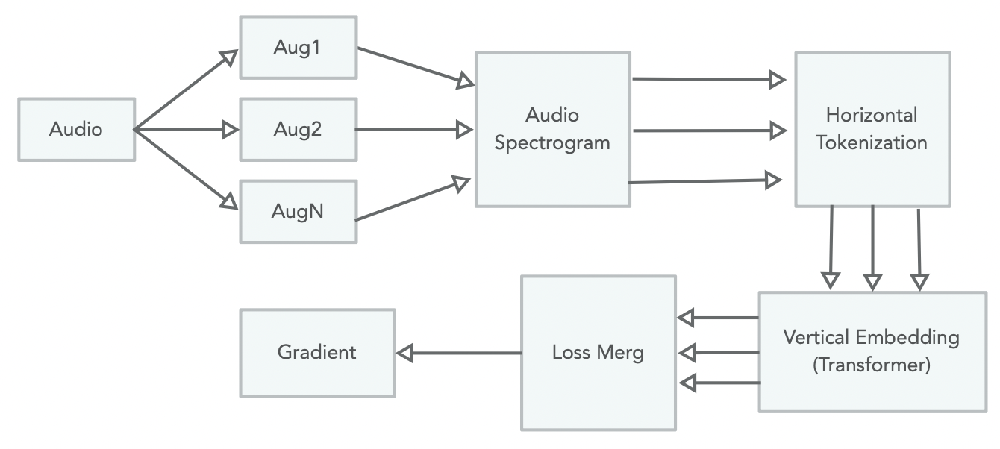

# Augmentation-based Multiview Audio Transformer (AMAuT) Framework for Audio Classification

Foundational models such as [SSAST](https://doi.org/10.1609/aaai.v36i10.21315), [EAT](https://doi.org/10.48550/arXiv.2401.03497), [HuBERT](https://doi.org/10.1109/TASLP.2021.3122291), [Qwen-Audio](https://doi.org/10.48550/arXiv.2311.07919), and [Audio Flamingo](https://doi.org/10.48550/arXiv.2402.01831) contribute to state-of-the-art classification performance in several well-known audio classification datasets. However, these models require a fixed sample rate with limited length options in input audio when pretrained weights are used, which limits their reusability. To address the issue, we propose **A**ugmentation-based **M**ultiview **Au**dio **T**ransformer (AMAuT), an alternative audio classification model that does not require pre-trained model weights, a specific sample rate, or a specific audio length. Specifically, AMAuT adopts a Transformer architecture, but innovatively combines auodio Mel-spectrogram with 1D tokenization, a new 1D CNN bottleneck prior to Transformer embedding, and two class tokens sandwitching audio embeddings for classification. AMAuT is trained by aggregating prediction losses based on multiview augmentations of the same input audio, which provides less noisy gradients for updating model weights compared to conventional sequential augmentations. AMAuT adopts model agonestic test-time augmentation and test-time adaptation $(TTA)^2$ at inference to address the issue of robustness and potential data distribution shift. These strategies of model design, training, and inference work synergistically, where experimental results show that AMAuT is comparable to and sometimes outperforms the state-of-the-art models on multiple datasets, including [AudioMNIST](https://github.com/soerenab/AudioMNIST/tree/master), [SpeechCommands V1](https://research.google/blog/launching-the-speech-commands-dataset/), [SpeechCommands V2](https://research.google/blog/launching-the-speech-commands-dataset/), [VocalSound](https://sls.csail.mit.edu/downloads/vocalsound/), and [CochlScene](https://github.com/cochlearai/cochlscene).

## Project Structure
+ **AuT**: the Augmentation-based Multiview Audio Transformer framework
+ **lib**: library
+ **result**: training and analysis results

## Software Environment
Machine image: nvidia/cuda:11.8.0-devel-ubuntu22.04
```shell
conda create --name AMAuT python=3.9 -y 
conda activate AMAuT
# CUDA 11.8
conda install pytorch==2.1.0 torchvision==0.16.0 torchaudio==2.1.0 pytorch-cuda=11.8 -c pytorch -c nvidia -y
conda install -y -c anaconda scipy==1.11.3
conda install conda-forge::ml-collections==0.1.1 -y
conda install pandas==2.2.2 -y
conda install tqdm==4.66.4 -y
conda install jupyter -y
conda install matplotlib==3.8.4 -y 
pip install wandb==0.17.1
```

In some cloud platforms, such as [Google Cloud](https://cloud.google.com). You should install more:
```shell
pip install soundfile
```

## Processing
### Preparing
```shell
export BASE_PATH=${the parent directory of the project}
git clone https://github.com/Andy-Shao/AMAuT.git
conda activate AMAuT
cd AMAuT
```

### Training
```shell
ssh AuT/script/speech-commands/train.sh
```

### Test-time Adaptation
```shell
ssh AuT/script/speech-commands/tta.sh
```

### Analysis
[Trained weights](https://drive.google.com/file/d/1C6thnM4-zZhyxxTh-52TfDdxLIh_Xa1P/view?usp=drive_link) for training and test-time adaptation on SpeechCommands V2.
```shell
ssh AuT/script/speech-commands/tta_analysis.sh
```

## Dataset
### AudioMNIST
This repository contains code and data used in Interpreting and Explaining Deep Neural Networks for Classifying Audio Signals. The dataset consists of 30,000 audio samples of spoken digits (0–9) from 60 different speakers. Additionally, it holds the audioMNIST_meta.txt, which provides meta information such as the gender or age of each speaker.

+ Sample size: 30000 (Train: 18000, Validation: 6000, Test: 6000)
+ Sample rate: 48000
+ Audio length: 1 second
+ Class Number: 10
<!-- + sample data shape: [1, 14073 - 47998] -->
  
[Official AudioMNIST Link](https://github.com/soerenab/AudioMNIST/tree/master)<br/>
[Dataset Hosting Link](https://drive.google.com/file/d/1kq5_qCKRUTHmViDIziSRKPjW4fIoyT9u/view?usp=drive_link)

### SpeechCommands V1
The dataset (1.4 GB) comprises 65,000 one-second-long utterances of 30 short words, contributed by thousands of different people through the AIY website. This is a set of one-second .wav audio files, each containing a single spoken English word.

In both versions, ten of them are used as commands by convention: "Yes", "No", "Up", "Down", "Left",
"Right", "On", "Off", "Stop", "Go". Other words are considered to be auxiliary (in the current implementation,
it is marked by the `True` value of `the "is_unknown"` feature). Their function is to teach a model to distinguish core words
from unrecognized ones.

+ Sample size: 64721 (train: 51088, test: 6835, validation: 6798)
+ Sampling rate: 16000
<!-- + Sample data shape: [1, 5945 - 16000] -->
+ Class number: 30
+ Audio length: 1 second

[Speech Commands Dataset Link](https://research.google/blog/launching-the-speech-commands-dataset/)<br/>
[Dataset Download Link](http://download.tensorflow.org/data/speech_commands_v0.01.tar.gz)

### SpeechCommands V2
Add five new words to the Dataset, such as 'backward', 'forward', 'follow', 'learn', and 'visual'.

+ Sample size: 105829 (train: 84843, test: 11005, validation: 9981)
+ Sampling rate: 16000
+ Class number: 35
+ Audio length: 1 second
  
[Speech Commands Dataset Link](https://research.google/blog/launching-the-speech-commands-dataset/)<br/>
[Pytorch Document](https://pytorch.org/audio/main/generated/torchaudio.datasets.SPEECHCOMMANDS.html)

### VocalSound
VocalSound is a free dataset consisting of 21,024 crowdsourced recordings of laughter, sighs, coughs, throat clearing, sneezes, and sniffs from 3,365 unique subjects. The VocalSound dataset also contains meta-information such as speaker age, gender, native language, country, and health condition.

+ Sample Size: 20977 (Train: 15531, validation: 1855, test: 3591)
+ Sample rate: 16000
+ Audio length: less than 12 seconds
+ Class number: 6

[VocalSound Dataset Link](https://sls.csail.mit.edu/downloads/vocalsound/)<br/>
Download command:
```shell
wget -O vocalsound_16k.zip https://www.dropbox.com/s/c5ace70qh1vbyzb/vs_release_16k.zip?dl=1
```

### CochlScene
Cochl Acoustic Scene Dataset, or CochlScene, is a new acoustic scene dataset whose recordings are fully collected from crowdsourcing participants. Most of the initial plans and guidelines for the processes were provided by researchers in the field of audio signal processing and machine learning, including the authors. The actual process was performed using a crowdsourcing platform developed by SelectStar, a Korean crowdsourcing data company. During the process, the initial plans were reinforced and modified based on the discussion about the actual difficulties in the collection process. After extracting a subset of the total collections based on the data's purpose, we collected 76,115 10-second files from 13 different acoustic scenes involving 831 participants.

+ Sample rate: 44100
+ Sample size: 76115 (Train: 60855, validation: 7573, test: 7687)
+ Audio length: 10 seconds
+ Class number: 13

[Github Link](https://github.com/cochlearai/cochlscene)<br/>
[Dataset Link](https://zenodo.org/records/7080122)

## Code Reference
+ [CoNMix](https://github.com/vcl-iisc/CoNMix/tree/master)
+ [TransUNet](https://github.com/Beckschen/TransUNet)
+ [TTA in Audio Classification](https://github.com/Andy-Shao/TTA-in-AC.git)
+ [AudioMNIST](https://github.com/soerenab/AudioMNIST/tree/master)
