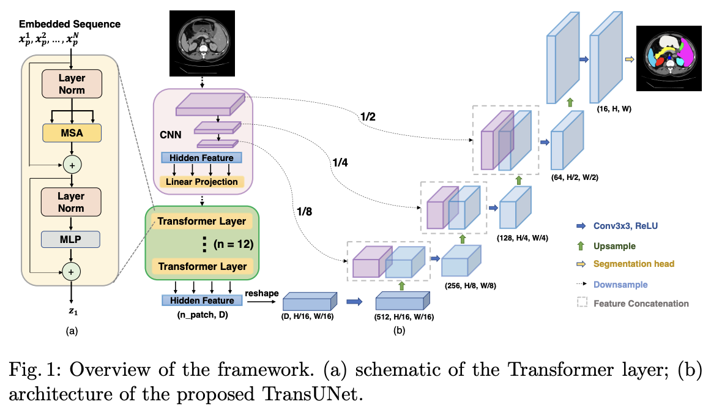

# TransUNet Structure

Figure. 1 comes from:
```bibtex
@article{chen2021transunet,
  title={TransUNet: Transformers Make Strong Encoders for Medical Image Segmentation},
  author={Chen, Jieneng and Lu, Yongyi and Yu, Qihang and Luo, Xiangde and Adeli, Ehsan and Wang, Yan and Lu, Le and Yuille, Alan L., and Zhou, Yuyin},
  journal={arXiv preprint arXiv:2102.04306},
  year={2021}
}
```


# Code reference
+ [TransUNet](https://github.com/Beckschen/TransUNet/tree/main)

# Rre-weight download
```shell
wget https://storage.googleapis.com/vit_models/imagenet21k/R50+ViT-B_16.npz
mkdir -p model/vit_checkpoint/imagenet21k
mv R50+ViT-B_16.npz model/vit_checkpoint/imagenet21k/R50+ViT-B_16.npz
```